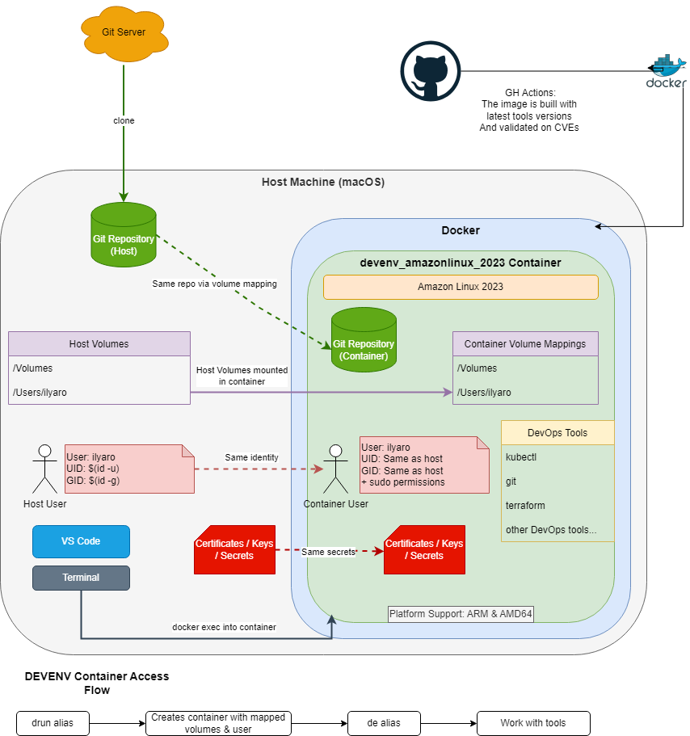

# Docker devenv image for DevOps, based on Amazon Linux 2023

## The toolbox with all latest and validated versions of all the tools you need for work, built for ARM and AMD.

### Example for MAC: 
Pull the image, map all volumes, and user you need.
Execute it and start using the toolbox

```
alias drun='export IMNAME=devenv_amazonlinux_2023 && docker run -it -d --restart unless-stopped --name "${IMNAME}" -v /Volumes:/Volumes -v "${HOME}:${HOME}" -v /etc/resolv.conf:/etc/resolv.conf  --user root --env HOME="${HOME}" --env USER="${USER}" --env UID="$(id -u)" --env GID="$(id -g)" --entrypoint /bin/bash gfish/${IMNAME} -c "getent group \$GID || groupadd -g \$GID \$USER; id -u \$UID || useradd -m -u \$UID -g \$GID -d \$HOME -s /bin/bash \$USER; echo \"\$USER ALL=(ALL) NOPASSWD: ALL\" > /etc/sudoers.d/\$USER; chmod 0440 /etc/sudoers.d/\$USER; tail -f /dev/null"'

alias de='export IMNAME=devenv_amazonlinux_2023 && docker exec -it ${IMNAME} bash -c "export HOME=${HOME} && cd $HOME && sudo su - ${USER}"'
```

### Example for Windows WSL: 
Tested on Ubuntu WSL host

```
alias drun='export IMNAME=devenv_amazonlinux_2023;docker rm -f ${IMNAME};docker run --restart unless-stopped --name ${IMNAME} -it -d -v /mnt/d:/mnt/d -v /mnt/c:/mnt/c -v ${HOME}:${HOME} -v /etc/passwd:/etc/passwd -v /etc/shadow:/etc/shadow -v /etc/group:/etc/group -v /etc/ssl/certs:/etc/ssl/certs -v /etc/ssl/certs:/etc/pki/tls/certs -v /etc/sudoers:/etc/sudoers:ro -v /etc/sudoers.d:/etc/sudoers.d:ro gfish/${IMNAME}:latest'

alias de='export IMNAME=devenv_amazonlinux_2023 && docker exec -it ${IMNAME} bash -c "export HOME=${HOME} && cd $HOME && sudo su - ${USER}"'
```

### Ready to work inside the container
```
[user@7913223cfc84 docker_devenv]$ k help
kubectl controls the Kubernetes cluster manager.
```

### Schema of working with docker DevEnv


